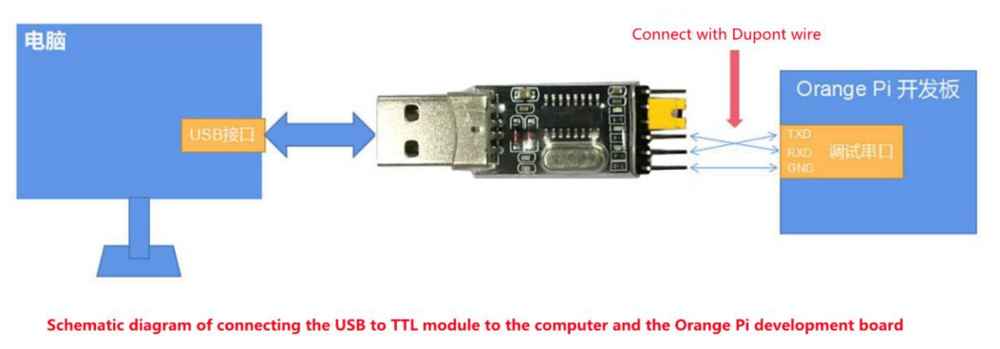

import UserMention from '@/components/custom-mdx/UserMention'

## Referensi
* [_Orange Pi 5 Plus User Manual_](https://drive.google.com/file/d/1enrNSQLKco86w7mUOBl6wU4exos6OMD1/view)
* [Armbian Quick Start Guide](https://docs.armbian.com/User-Guide_Getting-Started)
* [Orange Pi board setup](https://uthings.uniud.it/orange-pi-board-setup)
* [[Video] _Booting Up Orange Pi via USB to Serial TTL SSH For The First Time Configuration_](https://www.youtube.com/watch?v=kS1x6nrnnK0)
* [[Video] _minicom serial video how to_](https://www.youtube.com/watch?v=0tCOEO3LCC8)

## Prasyarat
1. Memiliki alat **_USB to TTL module_**. <UserMention name="Halim" />
  * Spesifikasi:

   | _Voltage_   | _IC (Integrated Circuit)_   | _Baud Rate_   |
   |-------------|-----------------------------|---------------|
   | 3.3V        | CH340 (_recommended_)       | 1.500.000 bps |
   > Tabel: Rekomendasi Spesifikasi _USB to TTL module_ [^1]
2. Memiliki device **PC / Laptop**.
  * Sudah ter-_install_ **_Ubuntu 22.04_**.
  * Sudah ter-_install_ **_Minicom_**.
3. Memiliki device **_Orange Pi 5 Plus_**.
4. Memiliki memory **_SD Card_**.
  * Sudah ter-_install_ _OS (Operating Sytem)_, contoh: **_Armbian_**.
  * Spesifikasi:

   | _Brand_   | _Speed_                                                                                | _Capacity_   |
   |-----------|----------------------------------------------------------------------------------------|--------------|
   | _SanDisk_ | Class 10 >= ?<br/>pilih _A1 rated (Class 10)_ jika kalian menggunakan _OS Armbian_ [^5] | 16GB >= ?    |
   > Tabel: Rekomendasi Spesifikasi _SD Card_ [^2]

## Tutorial
1. Pasangkan **_SD Card_** ke **_Orange Pi 5 Plus_**.
2. Nyalakan **PC / Laptop** dan **_Orange Pi 5 Plus_**.
3. Pasangkan **_USB to TTL_** ke **PC / Laptop** dan **_Orange Pi 5 Plus_**.
   ")
   > Gambar: _Orange Pi 5 Plus Development Board_ [^3]

   
   > Gambar: _Connecting USB TTL Diagram_ [^4]
4. Setup **_Minicom_**.
   ```bash
   oxw@oxw:~$ ls /dev/ttyUSB*
   # /dev/ttyUSB0

   oxw@oxw:~$ minicom -s
   # Select "Serial port setup"
   # Setting "A - Serial device : /dev/ttyUSB0"
   # Setting "E - Bps/Par/Bits : 1500000 8N1"
   # Select "Save setup as dfl"
   # Select "Exit From Minicom"
   ```
5. Koneksikan **_Minicom_** ke **_Orange Pi 5 Plus_**.
   ```bash
   oxw@oxw:~$ minicom
   ```
6. Selesai.


[^1]: [(1) _Orange Pi 5 Plus User Manual_](https://drive.google.com/file/d/1enrNSQLKco86w7mUOBl6wU4exos6OMD1/view), halaman 131-133.
[^2]: [(2) _Orange Pi 5 Plus User Manual_](https://drive.google.com/file/d/1enrNSQLKco86w7mUOBl6wU4exos6OMD1/view), halaman 6.
[^3]: [(3) _Orange Pi 5 Plus User Manual_](https://drive.google.com/file/d/1enrNSQLKco86w7mUOBl6wU4exos6OMD1/view), halaman 132.
[^4]: [(4) _Orange Pi 5 Plus User Manual_](https://drive.google.com/file/d/1enrNSQLKco86w7mUOBl6wU4exos6OMD1/view), halaman 133.
[^5]: [(5) _How to prepare a SD card? - Armbian Quick Start Guide_](https://docs.armbian.com/User-Guide_Getting-Started/#how-to-prepare-a-sd-card).


