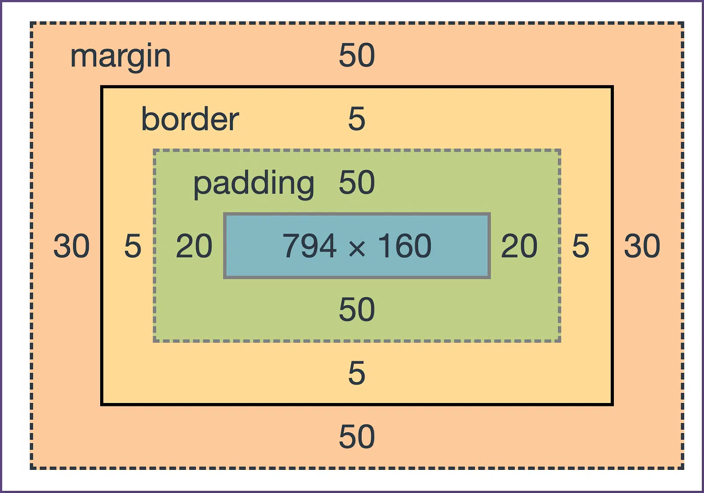

{/*  */}
{/*  https://www.vecteezy.com/vector-art/7661760-monochrome-background-with-retro-pattern-design*/}
{/* https://developer.mozilla.org/en-US/docs/Web/CSS/padding */}

## Pendahuluan
Mungkin kita sudah paham fungsi *padding* itu untuk apa, dan bagaimana kita menggunakannya. Namun apakah kita tahu penulisannya itu seperti apa dan apa saja macamnya?

Sebelum kita mulai dengan macam-macam *padding*, kita *re-call* sejenak apa itu *padding* di CSS.

 
 > Gambar: _Content, Padding, Border, Margin_ [^image-elements]

*Padding* adalah sebuah properti CSS yang digunakan untuk mengatur jarak antara elemen dan elemen lainnya. Dalam CSS, padding digunakan untuk memberikan jarak antara konten dengan border.

{/* <p class="codepen" data-height="400" data-default-tab="css,result" data-slug-hash="ZEZzWyY" data-pen-title="Untitled" data-editable="true" data-user="oxwazz" style="height: 300px; box-sizing: border-box; display: flex; align-items: center; justify-content: center; border: 2px solid; margin: 1em 0; padding: 1em;"> */}
{/*   <span>See the Pen <a href="https://codepen.io/oxwazz/pen/ZEZzWyY"> */}
{/*   Untitled</a> by Muhammad Rahmahalim (<a href="https://codepen.io/oxwazz">@oxwazz</a>) */}
{/*   on <a href="https://codepen.io">CodePen</a>.</span> */}
{/* </p> */}
{/* <script async src="https://cpwebassets.codepen.io/assets/embed/ei.js"></script> */}


## Macam-Macam Penulisan CSS *Padding*
Ada banyak cara untuk menuliskannya, kalau kita merujuk ke [Dokumentasi MDN](https://developer.mozilla.org/en-US/docs/Web/CSS/padding/) [^link-doc-mdn-padding] ada setidaknya 11 macam penulisan, seperti:
 1. *padding*
 1. *padding-block*
 1. *padding-block-end*
 1. *padding-block-start*
 1. *padding-bottom*
 1. *padding-inline*
 1. *padding-inline-end*
 1. *padding-inline-start*
 1. *padding-left*
 1. *padding-right*
 1. *padding-top*

 ## Contoh Penulisan CSS *Padding*
 berikut ini adalah beberapa contoh kasus yang memiliki output yang sama dari masing-masing penulisan:

 ### Contoh 1
   ```css
   /* .p-1, .p-2, .p-3, .p-4, .p-5, dan .p-6  */
   /* memiliki output yang sama */

    .p-1 {
       padding: 17px;
    }

    .p-2 {
       padding: 17px 17px;
    }

    .p-3 {
       padding: 17px 17px 17px 17px;
    }

    .p-4 {
      padding-top: 17px;
      padding-right: 17px;
      padding-bottom: 17px;
      padding-left: 17px;
    }

    .p-5 {
      padding-inline: 17px;
      padding-block: 17px;
    }

    .p-6 {
      padding-inline-start: 17px;
      padding-inline-end: 17px;
      padding-block-start: 17px;
      padding-block-end: 17px;
    }

   ```

 ### Contoh 2
 ```css
   /* .p-1, .p-2, .p-3, .p-4, dan .p-5  */
   /* memiliki output yang sama */
    .p-1 {
       padding: 20px 10px;
    }

    .p-2 {
       padding: 20px 10px 20px 10px;
    }

    .p-3 {
      padding-top: 20px;
      padding-right: 10px;
      padding-bottom: 20px;
      padding-left: 10px;
    }

    .p-4 {
      padding-inline: 20px;
      padding-block: 10px;
    }

    .p-5 {
      padding-inline-start: 10px;
      padding-inline-end: 10px;
      padding-block-start: 20px;
      padding-block-end: 20px;
    }

   ```

Selesaiii, Terima kasihhh :D

[^image-elements]: [Gambar: _Content, Padding, Border, Margin_](https://blogs.purecode.ai/blogs/css-padding/) - blogs.purecode.ai
[^link-doc-mdn-padding]: [Link: Dokumentasi MDN Padding](https://developer.mozilla.org/en-US/docs/Web/CSS/padding/) - developer.mozilla.org

